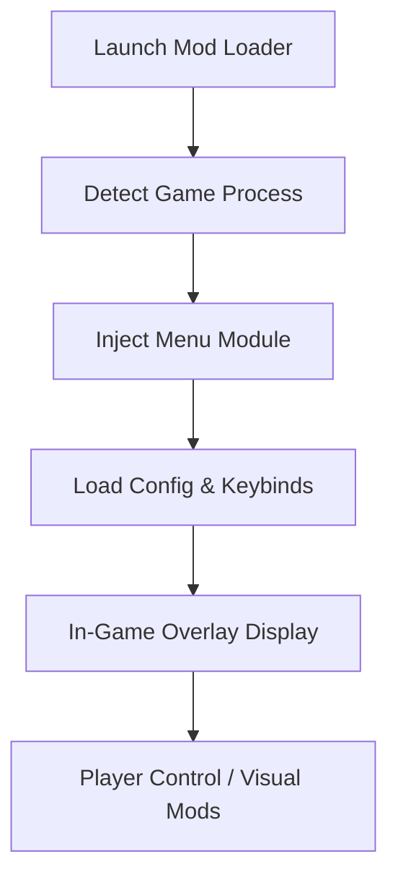

# 🧪 Abiotic Factor Mod Menu – Complete Control & Exploration Utility

The **Abiotic Factor Mod Menu** is a dynamic all-in-one enhancement tool that merges customization, exploration freedom, and total player control into a single intuitive overlay. Built for sandbox sessions, creative experiments, or debugging Unreal 5 features, this mod menu gives you **real-time access** to cheats, tweaks, and experimental modules — all without touching your base files.

Perfect for solo explorers, mod developers, or creative testers who want full command of the *anomalous facility*.

---

## 🧩 Key Features Overview

### ⚙️ Real-Time Mod Menu Overlay

Open and control every module directly in-game without minimizing or restarting.

* **Hotkey:** `Insert` to open / close
* **Tab Sections:** Player • Environment • Items • Visuals • Debug
* Full mouse + controller navigation
* Color themes: Neon Blue / Graphite / Dark Mode

### 💥 Player & World Controls

Take charge of everything from movement to the environment.

* God Mode & No-Clip toggle
* Custom speed and gravity scaling
* Infinite stamina and oxygen
* Day/night cycle slider with instant apply

> [!NOTE]
> The menu is script-injected at runtime, leaving no permanent game file edits — 100% reversible.

---

## 🎒 Item & Spawn Manager

Spawn any weapon, resource, or crafting item instantly.
Includes full ID-based search, filtering by rarity, and auto-stacking.

| Function         | Description                        | Example                  |
| ---------------- | ---------------------------------- | ------------------------ |
| **Spawn Item**   | Add resource directly to inventory | `spawn metal_bar 50`     |
| **Batch Mode**   | Spawn multiple items via JSON      | `load kit survival.json` |
| **Save Presets** | Export your current loadout        | `/export inventory.json` |

Example preset:

```json
{
  "inventory": [
    {"item": "metal_bar", "count": 50},
    {"item": "oxygen_tank", "count": 2},
    {"item": "science_toolkit", "count": 1}
  ]
}
```

---

## 👁 ESP & Environment Awareness Tools

Visualize your surroundings with a **toggleable ESP (Environmental Sense Protocol)**.

* Player outline and distance markers
* Resource glow (metals, anomaly cores, tech parts)
* AI/NPC tracking through walls
* Adjustable opacity and detection radius (up to 400m)

> [!IMPORTANT]
> ESP is purely local visualization; it doesn’t modify AI or physics data — safe for exploration or testing builds.

---

## 🚀 Teleportation & Debug Systems

Quickly move through the complex or test map regions.

* Save up to **10 teleport slots**
* Coordinate-based warp console
* “Map Hover” mode for flying traversal

Command line:

```bash
> teleport lab_a
> teleport reactor_core
> setgravity 0.5
```

---

## 💻 Compatibility & Modes

| Component         | Supported                   | Details                       |
| ----------------- | --------------------------- | ----------------------------- |
| **Game Engine**   | Unreal Engine 5             | Supports DX11 & DX12          |
| **Game Version**  | Steam / Early Access        | Auto-sync via patch detection |
| **Play Modes**    | Offline / LAN Co-op         | Fully supported               |
| **Input Devices** | Mouse, Keyboard, Controller | All bindings editable         |

> [!WARNING]
> Multiplayer and public online play modification is not supported. Use for **local sandbox or mod testing** only.

---

## 🧠 Internal Process Flow



---

## ⚡ Advanced Modules

* **XP & Research Boosts:** Instantly complete experiments.
* **Freeze AI / Physics:** Pause dynamic entities for capture or study.
* **Weather Modulator:** Manually set storm intensity and radiation levels.
* **Instant Build Mode:** Construct base components with 1-click assembly.
* **Lighting Editor:** Adjust bloom, shadows, and fog depth for screenshots.

> [!NOTE]
> For best visual mods, run the game in **DirectX 12 Borderless** to reduce flicker in overlays.

---

## 🧠 Example Quick Config

```json
{
  "god_mode": true,
  "esp_enabled": true,
  "weather": "clear",
  "speed_multiplier": 2.5,
  "spawn_items": ["science_toolkit", "oxygen_tank"]
}
```

Load with:

```bash
> modmenu load quick.json
```

---

## ❓ FAQ

**Q1: Is the mod menu safe for my saves?**
Yes. It uses non-persistent hooks that unload completely when the game closes.

**Q2: Can I import my trainer settings?**
Yes — it supports `.json` imports from the Abiotic Factor Trainer for seamless integration.

**Q3: Does it affect performance?**
Minimal impact (<2% CPU usage) since rendering runs on GPU overlay threads.

**Q4: Will it auto-update with patches?**
Yes, auto-offset scanning ensures continued compatibility with each game update.

**Q5: Can I disable individual modules?**
Yes. Every function includes its own toggle or hotkey, so you can customize your session completely.

---

## 🧬 Final Thoughts

The **Abiotic Factor Mod Menu** redefines sandbox freedom — giving you a toolkit for experimentation, exploration, and pure creative fun. From ESP overlays to instant builds and teleport systems, every feature integrates smoothly into the game’s atmosphere. Stable, adaptive, and endlessly customizable — this is *your laboratory, your rules.*

---

**Experiment deeper. Build faster. Own every anomaly.**
